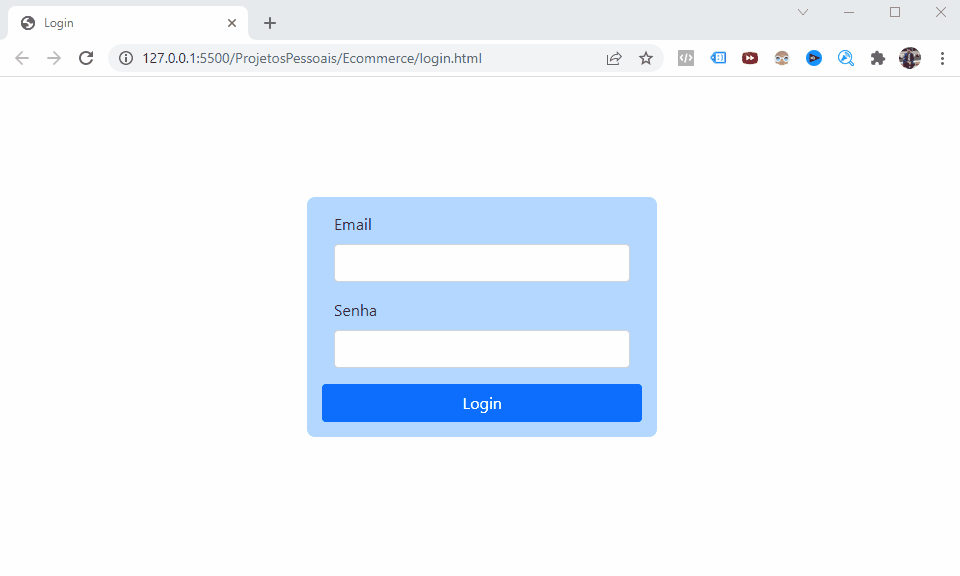

<h1 align="center">Projeto Sistema Eccomerce - EM CONSTRUÇÃO</h1>

 

  

Validando a Senha por LocalStorage

  

<h1 align="center">
    
</h1>

 

### 🛠 Tecnologias

As seguintes ferramentas foram usadas na construção do Projeto: 

- [JavaScript](https://developer.mozilla.org/pt-BR/docs/Web/JavaScript)
- [VSCode](https://code.visualstudio.com/)
- [HTML](https://developer.mozilla.org/pt-BR/docs/Web/HTML) 
- [CSS](https://developer.mozilla.org/pt-BR/docs/Web/CSS)
- [Via CEP - API utilizada](https://viacep.com.br/)

---

Feito com 🤩 by Wires Teles 😎 [Veja meu Linkedin](https://www.linkedin.com/in/wires-teles-javascript-dev/) 